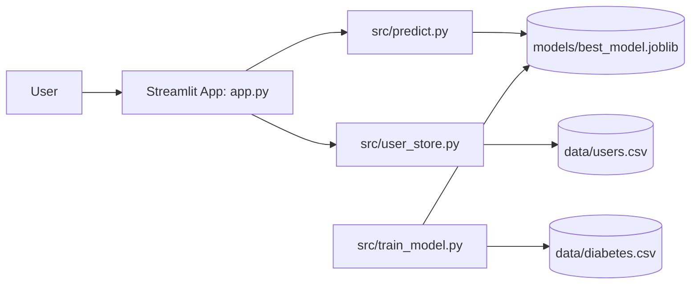
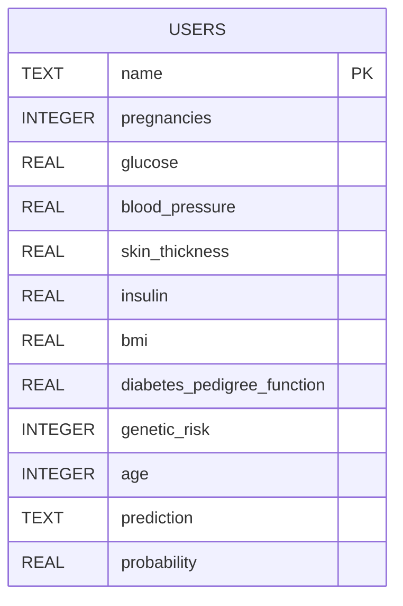

# Software Requirements Specification (SRS)
## Project: DiabetesInsight - Early Diabetes Risk Prediction System

## 1. Introduction
### 1.1 Purpose
This document specifies the functional and non-functional requirements for a machine learning web application that predicts diabetes risk from user health inputs.

### 1.2 Scope
The system provides:
- User registration/login by unique name
- Diabetes risk prediction using a trained ML model
- Risk probability display and recommendation
- CSV-based persistence of user inputs and outputs

The current deployment target is local execution via Streamlit.

### 1.3 Definitions
- `ML`: Machine Learning
- `SRS`: Software Requirements Specification
- `CSV`: Comma-Separated Values file
- `Probability`: Model confidence score for diabetic class

## 2. Overall Description
### 2.1 Product Perspective
The product is a standalone Streamlit application with:
- Frontend/UI in `app.py`
- Model training/inference utilities in `src/`
- Storage in `data/users.csv`
- Trained pipeline in `models/best_model.joblib`

No separate backend API is required in the current architecture.

### 2.2 Product Functions
- Accept health metrics from user
- Load trained model and generate prediction
- Show risk percentage and health guidance
- Save/update user profile and latest prediction
- Prevent duplicate user registration

### 2.3 User Classes
- `General User`: Enters details and gets diabetes risk output
- `Project Admin/Developer`: Trains model and maintains files/configuration

### 2.4 Operating Environment
- OS: Windows/Linux/macOS
- Runtime: Python 3.x
- UI runtime: Streamlit
- Dependencies: pandas, scikit-learn, joblib, python-dotenv

### 2.5 Constraints
- Storage is CSV-based, not transactional DB
- User identity is only a unique `name`
- Model quality depends on training dataset quality
- Internet is not required for core functionality

## 3. System Architecture
### 3.1 High-Level Flow
1. User opens Streamlit app.
2. User registers/logs in with a unique name.
3. User enters health metrics.
4. App loads cached model and predicts label + probability.
5. App shows result popup and recommendation.
6. App upserts record in `data/users.csv`.

### 3.2 Architecture Diagram

## 4. Functional Requirements
### FR-1 User Registration/Login
- System shall accept a user name as login identifier.
- System shall reject duplicate names with message `User already exists`.
- System shall create a new row for first-time user.

### FR-2 Session Management
- System shall persist login state during app session using Streamlit `session_state`.
- System shall provide logout and clear session values.

### FR-3 Input Collection
- System shall collect:
  `Pregnancies`, `Glucose`, `BloodPressure`, `SkinThickness`, `Insulin`, `BMI`, `DiabetesPedigreeFunction`, `GeneticRisk`, `Age`.
- System shall validate numeric bounds via input widgets.

### FR-4 Prediction
- System shall load saved model from `MODEL_PATH`.
- System shall generate:
  - Binary class label (`Diabetic` / `Not Diabetic`)
  - Probability score using `predict_proba` when available

### FR-5 Result Display
- System shall display risk analysis popup with:
  - risk percentage
  - risk category styling
  - recommendation text
  - close action

### FR-6 Data Persistence
- System shall ensure `data/users.csv` exists with required columns.
- System shall update existing user row after prediction.
- System shall not create duplicate rows for same user name.

### FR-7 Model Availability Check
- System shall warn user if model file is missing.
- System shall block prediction until model is trained and present.

## 5. Non-Functional Requirements
### NFR-1 Usability
- UI shall be beginner-friendly and executable with one command:
  `python -m streamlit run app.py`

### NFR-2 Performance
- Model loading shall use caching to avoid repeated disk loads.
- Prediction response should complete within a few seconds on local machine.

### NFR-3 Reliability
- CSV schema shall be enforced at runtime by storage utility.
- App shall handle inference/storage exceptions and show user-safe messages.

### NFR-4 Maintainability
- Code shall be modular:
  - UI (`app.py`)
  - prediction (`src/predict.py`)
  - training (`src/train_model.py`)
  - storage (`src/user_store.py`)

### NFR-5 Security/Privacy
- No password/auth token currently implemented.
- Data is local file-based; protection depends on machine/file permissions.
- Application is informational, not a clinical diagnosis system.

## 6. Data Requirements
### 6.1 Training Data
- File: `data/diabetes.csv`
- Must contain target column (default: `Outcome`)

### 6.2 User Data Schema
Current operational schema (`data/users.csv`):
- `name` (primary key semantics, unique)
- `pregnancies`
- `glucose`
- `blood_pressure`
- `skin_thickness`
- `insulin`
- `bmi`
- `diabetes_pedigree_function`
- `genetic_risk`
- `age`
- `prediction`
- `probability`

### 6.3 ER Diagram

## 7. External Interface Requirements
### 7.1 User Interface
- Login screen for name registration
- Main dashboard for health input and prediction
- Modal popup for risk result

### 7.2 Software Interfaces
- Local Python modules under `src/`
- Local model artifact via joblib
- Local CSV files in `data/`

### 7.3 Hardware Interfaces
- Standard personal computer; no special hardware dependency

## 8. Use Cases
### UC-1 New User Registration
1. User enters name.
2. System checks if name exists.
3. If not exists, system creates user record and logs in.

### UC-2 Duplicate User Attempt
1. Existing name entered.
2. System rejects and displays `User already exists`.

### UC-3 Risk Prediction
1. Logged-in user enters health metrics.
2. User clicks `Predict`.
3. System predicts and shows risk popup.
4. System stores latest values and output in CSV.

## 9. Assumptions and Dependencies
- Trained model file exists before prediction.
- Feature names expected by UI match model pipeline training schema.
- Python dependencies are installed from `requirements.txt`.

## 10. Future Enhancements (Out of Scope)
- Proper authentication (email/password/OAuth)
- Role-based access
- Relational database integration
- Audit logs and analytics dashboard
- Cloud deployment and API service split

## 11. Acceptance Criteria
- App launches via Streamlit command without backend service.
- New user can register; duplicate is blocked.
- Prediction returns label + probability.
- Result popup appears and closes correctly.
- `data/users.csv` is created/updated with no duplicate names.

